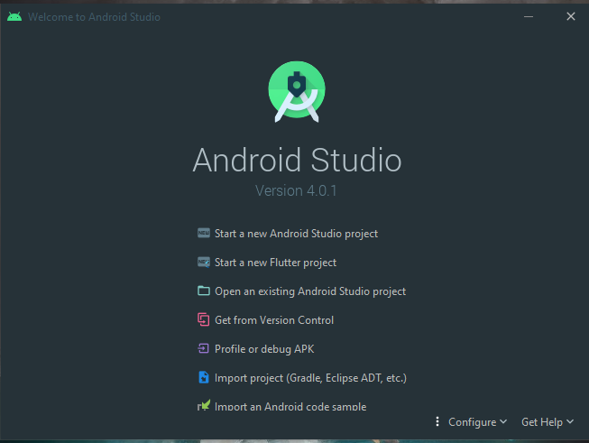
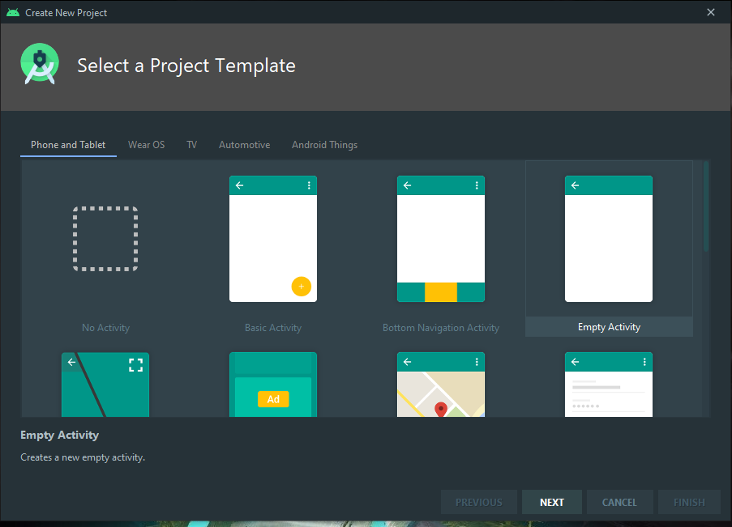
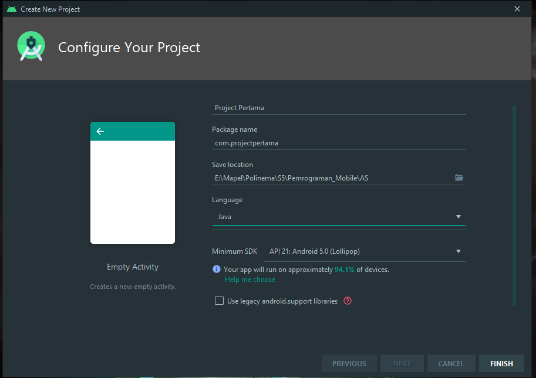
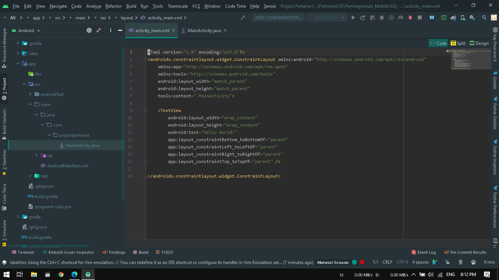
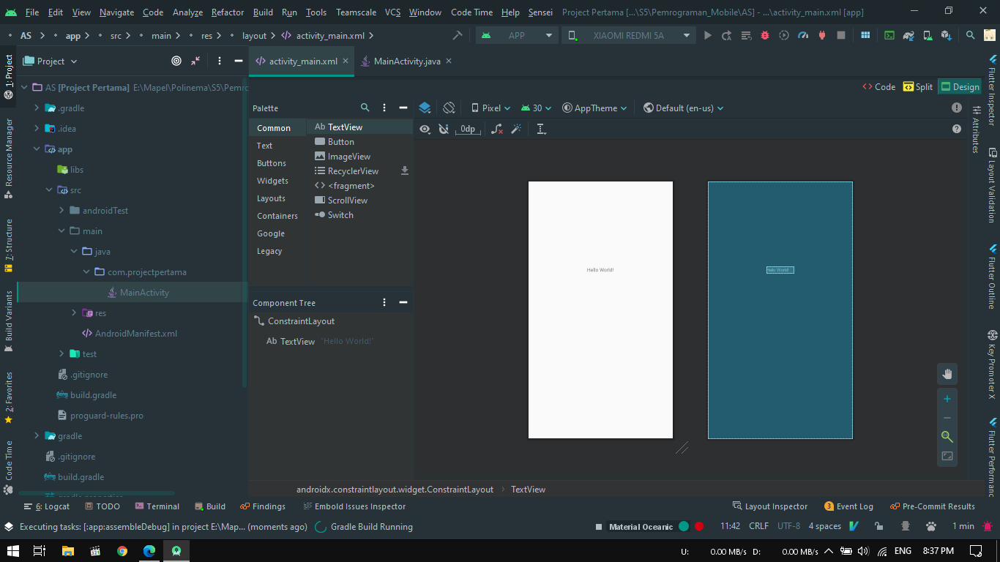
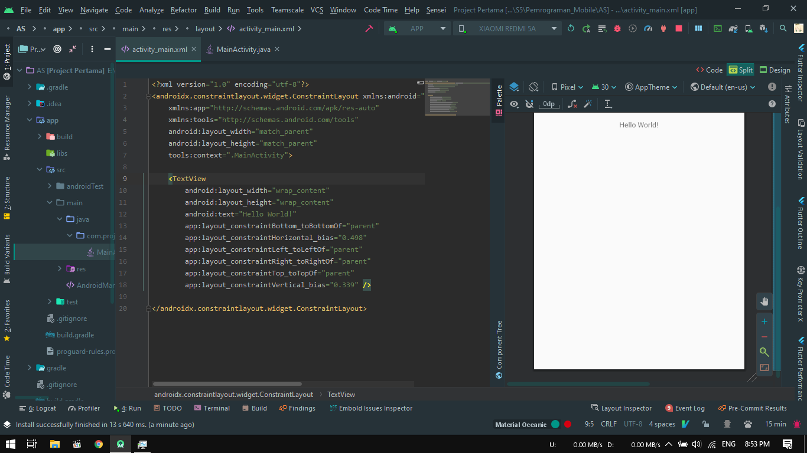
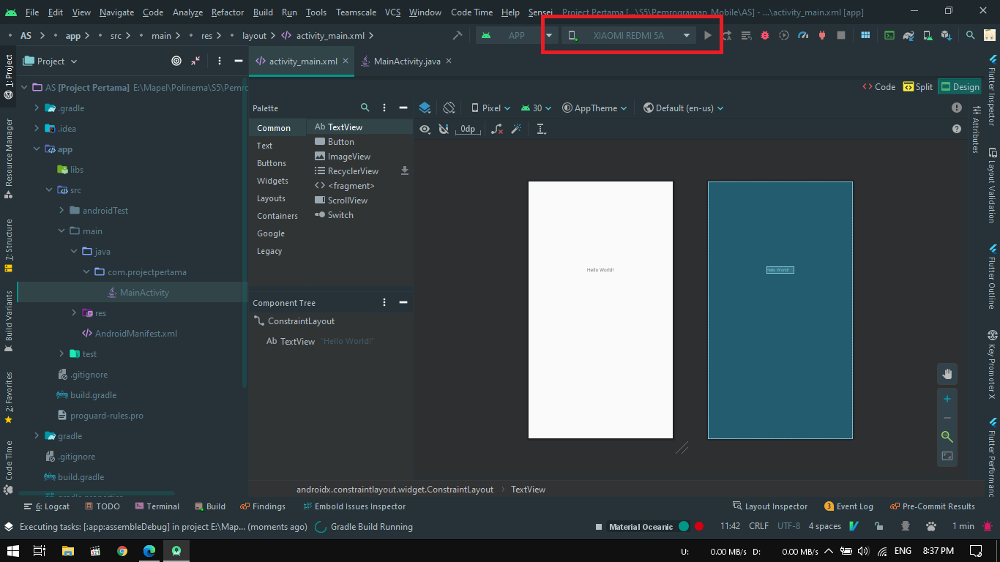
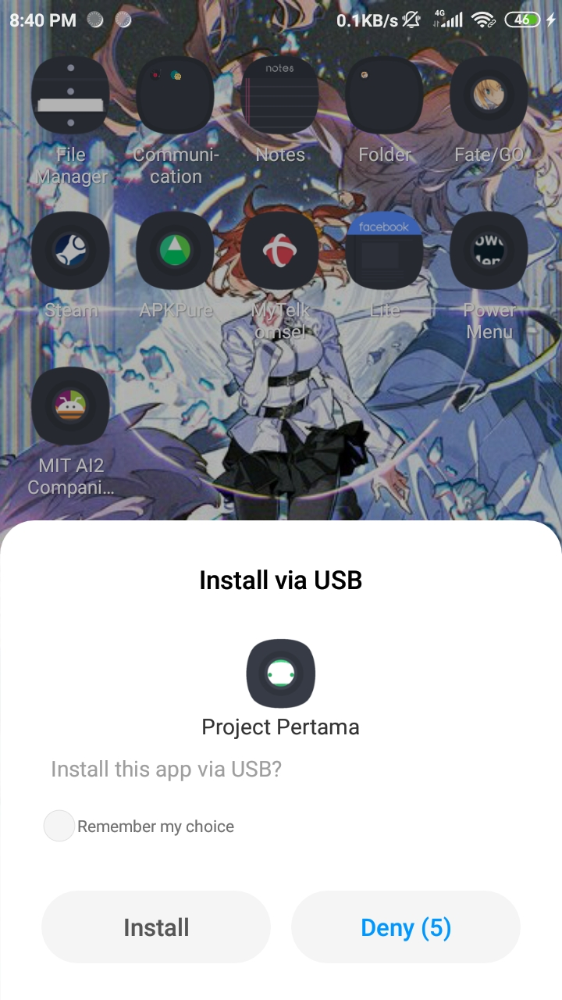

# Laporan Praktikum #1 - Hello World !

## Tujuan Pembelajaran

Setelah menempuh materi percobaan ini, mahasiswa mampu mengenal:
1. Mahasiswa mampu menginstall Android Studio, Android SDK, dan konfigurasi Kotlin
2. Mahasiswa Mampu menginstall Emulator
3. Mahasiswa Mampu Menghubungkan Perangkat Mobile Ke Komputer / Laptop

## Ringkasan Materi

1. Android studio merupakan sebuah program yang dikeluarkan oleh google yang dipergunakan untuk mendeveloping program berbasis android

## Praktikum

### Percobaan Hello World!

1. Pertama, jalankan android studio, setelah itu terdapat pilihan pilih new project

    

2. Kemudian pada menu template pilih blank activity 
   
    

3. Setelah itu, setting nama project, package, direktori project disimpan, bahasa pemrograman yang digunakan, dan versi minimal android yang dapat digunakan

    

4. Setelah project berhasil dibuat, maka akan diarahkan ke mainActivity.java. Untuk mengedit anda dapat masuk ke activity_main.xml. Dapat dipilih berdasarkan desain/kode/keduanya.

    
    
    

5. Untuk menjalankan project atau aplikasi, saya menggunakan device saya yaitu Xiaomi Redmi 5A. Pertama nyalakan USB debugging, kemudian aktifkan allow install unknown aplication
6. Pada bagian android studio terlihat device sudah terdeteksi, kemudian klik tombol run disebelahnya

    

7. Pada device akan muncul sebuah nontifikasi untuk install aplikasi, pilih install

    

8. Berikut tampilan jika aplikasi berhasil diinstall di device

    

Berikut untuk link ke file main activity : [klik untuk menuju file ](../../src/01_Pengantar_Android_Studio/MainActivity.java)

Berikut untuk link ke file activity_main : [klik untuk menuju file ](../../src/01_Pengantar_Android_Studio/activity_main.xml)

## Kesimpulan

Android Studio digunakan untuk membuat aplikasi android, dan terdapat beberapa varian SDK dari versi Ice Cream sampai R. Dalam pembuatan aplikasi android, dapat menggunakan bahasa java dan kotlin.

## Pernyataan Diri

Saya menyatakan isi tugas, kode program, dan laporan praktikum ini dibuat oleh saya sendiri. Saya tidak melakukan plagiasi, kecurangan, menyalin/menggandakan milik orang lain.

Jika saya melakukan plagiasi, kecurangan, atau melanggar hak kekayaan intelektual, saya siap untuk mendapat sanksi atau hukuman sesuai peraturan perundang-undangan yang berlaku.

Ttd,

***(Pandu Dwi Laksono)***