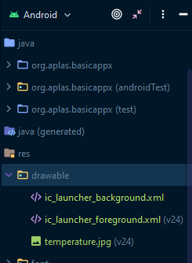

# Laporan Praktikum #2 - Layout

## Tujuan Pembelajaran

Setelah menempuh materi percobaan ini, mahasiswa mampu mengenal:
1. Mahasiswa memahami konsep layout pada android.
2. Mahasiswa memahami konsep View Group dan Hierarchy pada layout.
3. Mahasiswa mampu membuat layout sederhana
4. Mahasiswa menguasai layout editor dan kegunaannya pada android studio.

## Praktikum

### Pembuatan Project

1. Pertama, jalankan android studio, setelah itu terdapat pilihan pilih new project,kemudian pilih empty activity

    

2. Kemudian atur konfigurasi project seperti gambar dibawah ini (lokasi bisa menyesuaikan), kemudian klik finish
   
    

### Task Guide 1

1. Ubah isi file build.gradile pada module:app sesuai pada module kemudian klik **sync now**

    

2. Delete ExampleUnitTest di org.aplas.basicapp dan copy file test dan lainnya kedalam folder sesuai modul

    

3. Jalankan file test sesuai perintah modul, jika berhasil maka hasilnya akan seperti dibawah ini dan dapat lanjut ke modul selanjutnya

    

### Task Guide 2

1. Buatlah folder font dalam direktori res, dan atur nama dan resource menjadi font

    
    

2. masukan file font kedalam folder font

    

3. Atur file string dan color di folder res/values seperti di bawah ini

    
    

4. Copy file test dan lainnya kedalam folder sesuai modul dan jalankan file test. Jika berhasil maka hasilnya akan centang hijau

    

### Test Guide 3

1. Pada activity_main.xml ubah menjadi relative layout dan atur seperti gambar dibawah ini dan atur variabel tiap komponen sesuai modul

    

2. Kemudian copy file test ke dalam folder seperti sebelumnya dan jalankan, jika sukses maka hasilnya akan seperti dibawah 

    

### Test Guide 4

1. Tambahkan space dan linear layout, sesuaikan seperti modul

    
    

2. Copy test file kedalam folder dan jalankan

    

### Test Guide 5

1. Pada string.xml tambahkan array seperti dibawah

    

2. Pada linear layout yang dibuat sebelumnnya masukan komponen - komponen yang disebutkan dalam modul dan atur atribut sesuai modul

    

3. Salin file test ke dalam folder testing dan jalankan keduanya

    
    

### Test Guide 6

1. Buat linear layout (child2) lagi dibawah linear layout sebelumnya (child1) dan atur sesuai modul

2. Didalam linear layout (child2), tambahkan 2 buah checkbox dan atur sesuai modul

    
    

3. Salin file test dan jalankan

    

### Test Guide 7

1. Buat radiogroup dibawah linear layout (child2), dan masukan 3 buah radio button. Atur sesuai modul. Hasilnya seperti dibawah ini

    

2. Salin file test dan jalankan

    

### Test Guide 8

1. Coppy file gambar temperature.jpg kedalam folder res

    

2. Tambah imageView dibawah radiogroup dan atur sesuai modul

    

3. Copy file test dan jalankan

    

### Test Guide 9
1. Copy file cell_style.xml dan header_style.xml kedalam res/drawable

    

2. Dibawah imageView tambahkan TableLayout dan isinya, sesuaikan seperti modul sehingga hasilnya seperti dibawah

    

3. Salin file test dan jalankan

    

### Hasil

1. Jika sudah menjalankan semua guide build aplikasi(emulator/install via usb)

    
    

## Pernyataan Diri

Saya menyatakan isi tugas, kode program, dan laporan praktikum ini dibuat oleh saya sendiri. Saya tidak melakukan plagiasi, kecurangan, menyalin/menggandakan milik orang lain.

Jika saya melakukan plagiasi, kecurangan, atau melanggar hak kekayaan intelektual, saya siap untuk mendapat sanksi atau hukuman sesuai peraturan perundang-undangan yang berlaku.

Ttd,

***(Pandu Dwi Laksono)***