# Laporan Praktikum #3 - Activity

## Tujuan Pembelajaran

Setelah menempuh materi percobaan ini, mahasiswa mampu mengenal:
1. Mahasiswa memahami konsep dasar activity pada android.
2. Mahasiswa mampu membuat activity 

## Praktikum

### Pembuatan Java Class Temperature

1. Pertama, buatlah file java baru dengan nama Temperature

   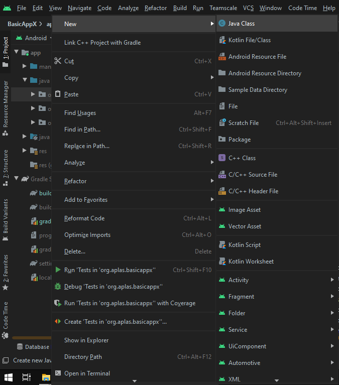<br>

2. Buat variabel double dengan nama celcius dan kondisi private, dan konstruktor dengan parameter kosong dan inisiati field celcius = 0
3. buat getter dan setter untuk celcius, fahrenheit dan Kelvin berdasarkan formula yang tersedia
4. Buat sebuah method convert untuk mengembalikan nilai baik dari nilai asli maupun yang terkonversi
5. Hapus semua file test yang berada di direktori **org.aplas.basicappx(test)**
6. Salin file test dan jalankan, jika sukses maka dapat lanjut ke modul berikutnya

   <br>


### Pembuatan Java Class Distance
1. Sama seperti modul sebelumnya, buatlah sebuah java baru dengan nama **Distance**

   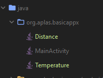<br>

2. Buatlah variabel private double dengan nama **meter** dan juga konstruktor seperti pada modul 1
3. Buat getter dan setter untuk meter, inch, mile, dan foot sesuai formula yang tersedia
4. Buat method convert untuk mengembalikan nilai asli maupun nilai yang terkonversi
5. Jika sudah selesai, salin file test ke direktori test dan jalankan. Jika berhasil maka hasil akan seperti dibawah ini dan dapat melanjutkan ke modul berikutnya

   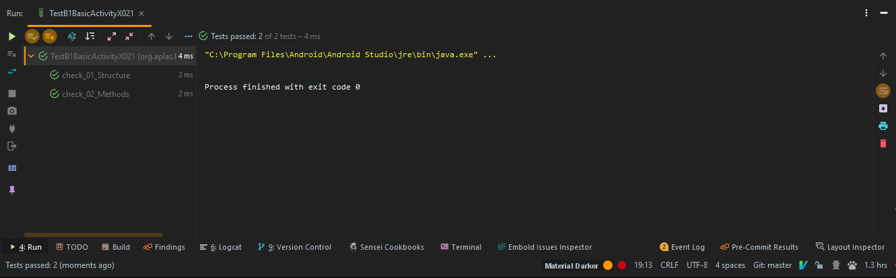<br>

### Pembuatan Java Class Weight

1. Buatlah file java dengan nama **Weight** ke dalam direktori sesuai dengan MainActivity

   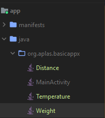<br>

2. Tambahkan variable private **gram** dengan tipe double dan juga konstruktor dengan parameter kosong dan inisiasi gram dengan nilai = 0
3. Buat getter dan setter untuk gram, ounche, pound dengan nilai konversi sesuai ukuran masing - masing
4. Buat method convert untuk mengembalikan nilai asli maupun nilai conversi
5. Salin file test yang telah disediakan sesuai modul dan jalankan. Jika sukses maka hasilnya akan seperti dibawah ini
   
   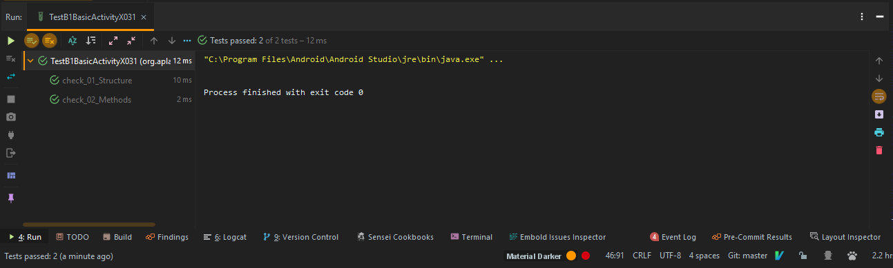<br>

### Memdefinisikan Field dan Method 

1. Pada MainActivity.java buatlah field baru sesuai modul sehingga hasilnya seperti dibawah ini

   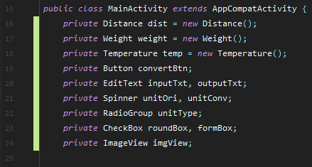<br>

2. Kemudian buatlah 2 buah method kosong : convertUnit dan srtResult dan isi sesuai langkah di modul
3. Salin test file dan jalankan, jika berhasil maka akan seperti gambar dibawah dan dapat melanjutkan ke modul berikutnya

   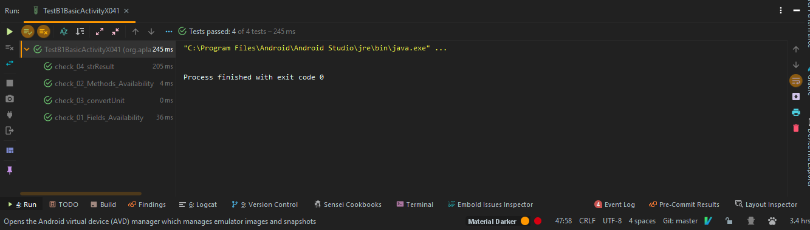<br>

### Membuat Method Override di Activity

1. Pada method onCreate atur layout yang aktif sesuai layout yang digunakan yaitu activity_main
2. Pada baris kode selanjutnya alokasikan field yang telah dibuat pada modul sebelumnya termasuk resource fieldnya

   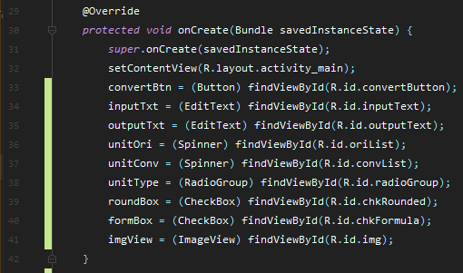<br>

3. Buatlah method onStart dibawah method onCreate
4. Buatlah field baru **AlertDialog** dengan kondisi private dan nama field startDialog
5. Masukan code yang ada di modul kedalam method onStart
6. Salin file test kedalam direktori dan jalankan. Jika berhasil maka hasilnya akan seperti dibawah ini dan dapat melanjutkan ke modul berikutnya

   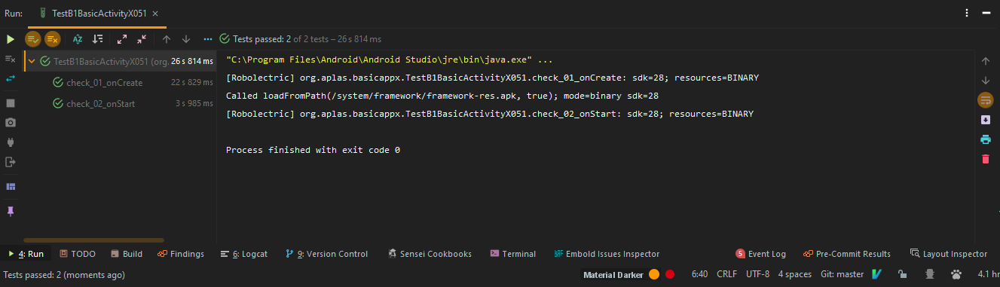<br>

### Membuat event RadioGroup

1. Pada string.xml tambahkan array seperti dibawah

   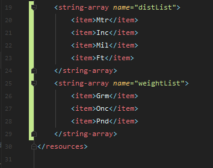<br>

2. Salin gambar distance dan weight kedalam direktori drawable

   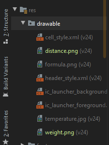<br>

3. Buatlah event RadioGroup di dalam method onCreate sesuai modul
4. Salin file test dan jalankan, jika berhasil maka hasilnya akan seperti dibawah dan dapat lanjut ke modul berikutnya

   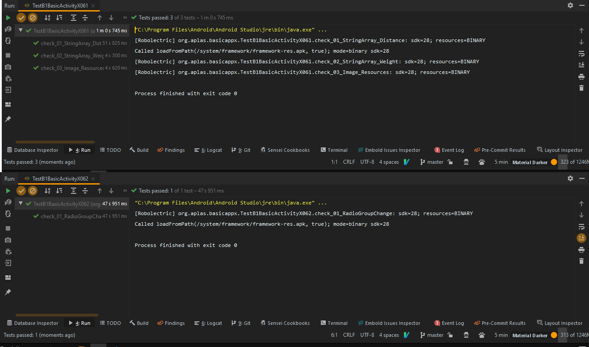<br>

### Membuat Method untuk Konversi Unit di Layout

1. Buat method baru doConvert dan isikan sesuai modul untuk mengembalikan nilai hasil conversi jika nilai diinputkan
2. Salin file test ke dalam direktori dan jalankan, jika berhasil maka dapat melanjutkan ke modul selanjkutnya

   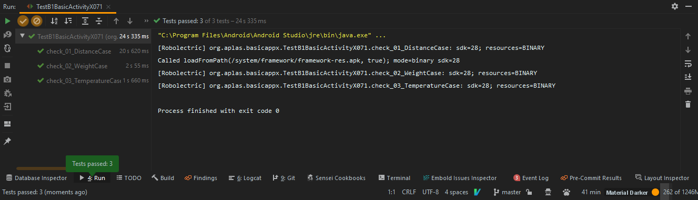<br>

### Membuat Widget EventListener

1. Buat sebuah event listener sesuai modul dibawah ``` unitType.setOnCheckedChangeListener ``` dimana jika button diklik akan memanggil method ``` doConvert() ```
2. Buat juga sebuah event listerner untuk mengambil aksi jika nilai asli / konversi berubah. Sesuaikan seperti modul
3. Buat event listener jika roundBox berubah seperti modul
4. Salin file test dan jalankan

   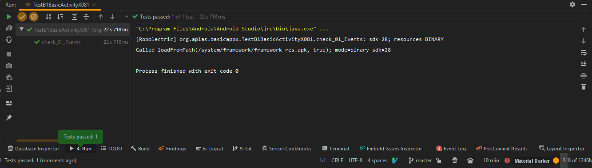<br>

### Membuat ImageView dan Event

1. Coppy file gambar formula.png kedalam folder drawable di dalam direktori res

   <br>

2. Tambah imageView dibawah radiogroup dan atur sesuai modul

   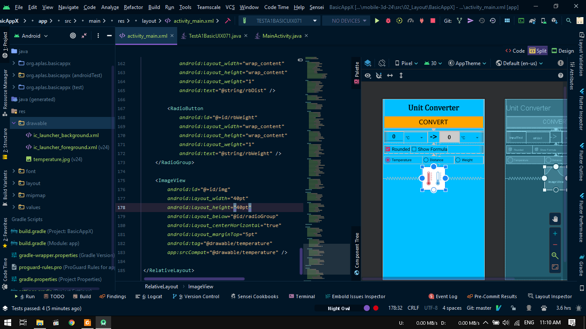<br>

3. Pada ```MainActivity.java``` buat sebuah event listerner untuk roundBox sesuai modul
4. Atur imageformula sesuai kondisi formbox yang dipilih
5. Copy file test dan jalankan

   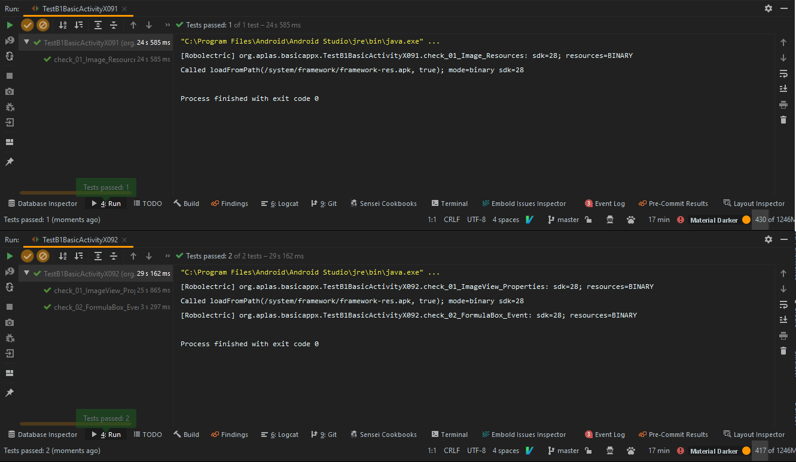<br>

### Hasil

1. Jika sudah menjalankan semua guide build aplikasi(emulator/install via usb) dan hasilnya seperti dibawah

   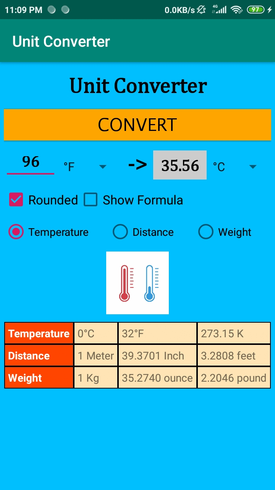<br>
   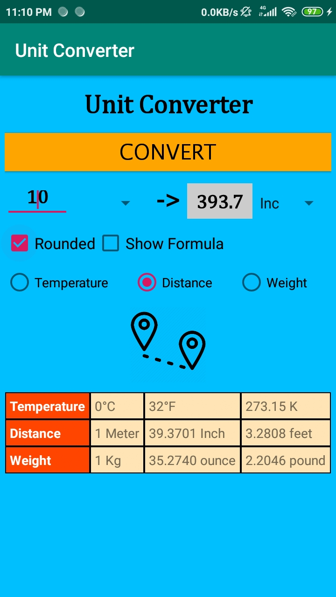<br>
   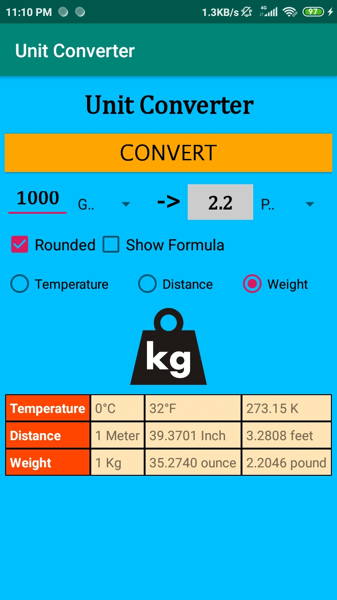<br>


## Pernyataan Diri

Saya menyatakan isi tugas, kode program, dan laporan praktikum ini dibuat oleh saya sendiri. Saya tidak melakukan plagiasi, kecurangan, menyalin/menggandakan milik orang lain.

Jika saya melakukan plagiasi, kecurangan, atau melanggar hak kekayaan intelektual, saya siap untuk mendapat sanksi atau hukuman sesuai peraturan perundang-undangan yang berlaku.

Ttd,

***(Pandu Dwi Laksono)***