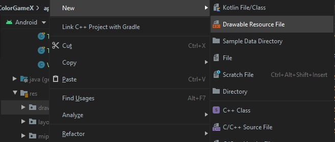
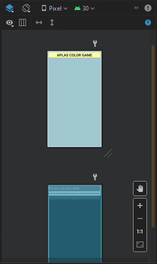
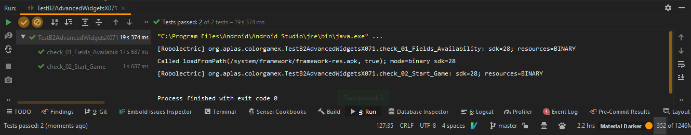
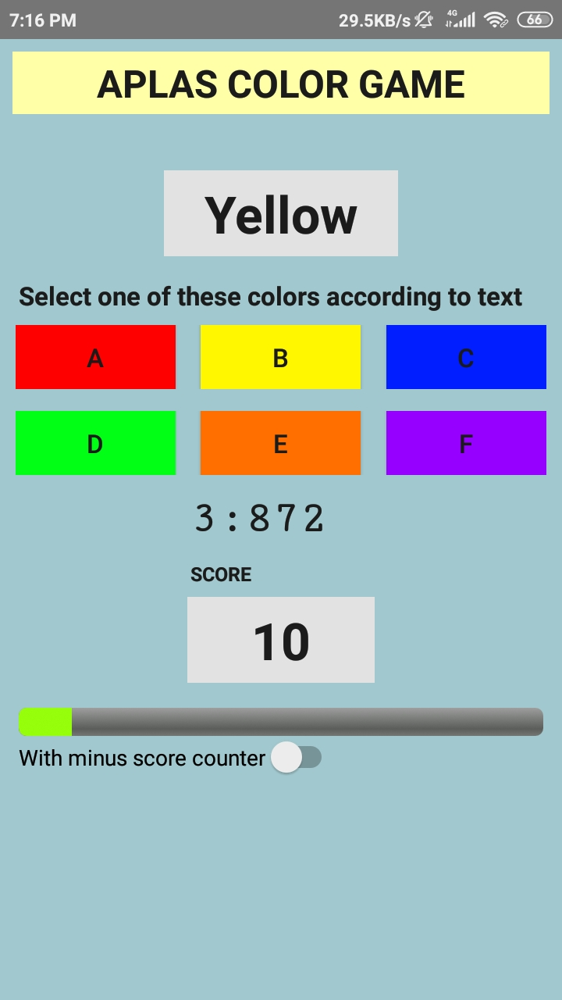

# Laporan Praktikum #4 - Advanced Widgets

## Tujuan Pembelajaran

Setelah menempuh materi percobaan ini, mahasiswa mampu mengenal:
1. Mahasiswa memahami style, tema, dan drawable vector image
2. Mahasiswa mampu membuat UI dari atribut melalui onClick 
3. Mahasiswa memahami cara kerja CountDown timer
4. Mahasiswa memahami cara kerja timer untuk memulai game
5. Mahasiswa memahami cara akses array dan menggunakannya pada List

## Praktikum

### Task Guide 1

1. Pertama, buatlah project baru dan pilih no activity

   <br>

2. Atur konfigurasi project seperti dibawah

   <br>

2. Pada color.xml, string.xml, dan styles.xml, atur konfigurasi seperti pada modul
3. Buat empty activity melalui cara dibawah ini dan atur konfigurasi seperti modul

   <br>

4. Buka andoridmanifest.xml dan ganti beberapa value seperti pada modul
5. Ganti isi dari ```build.graddle (Module: app)``` dengan menyalin code yang ada pada modul kemudian klik ***Sync it***
6. Salin file test dan jalankan, jika sukses maka dapat lanjut ke modul berikutnya

   <br>


### Task Guide 2
1. Salin ```ic_resicon.xml``` kedalam folder drawable

   <br>
2. Buatlah sebuah drawable shape baru dengan cara seperti dibawah ini dan beri nama ```round_btn.xml```

   <br>

3. Definisikan file xml tersebut seperti pada modul
4. Atur tag yang ada pada ```round_btn.xml``` seperti pada modul sehingga hasilnya seperti dibawah ini

   <br>

4. tambahkan style baru pada ```styles.xml``` dengan nama ***ColoredButton*** dan atur sesuai dengan modul
5. Jika sudah selesai, salin file test ke direktori test dan jalankan. Jika berhasil maka hasil akan seperti dibawah ini dan dapat melanjutkan ke modul berikutnya

   <br>

### Task Guide 3

1. Buka file ```activity_layout.xml``` dan hapus ***ConstraintLayout*** beserta tagnya kemudian ganti dengan LinearLayout serta akonfigurasi seperti pada modul
2. Tambahkan komponen - komponen kedalam LinearLayout tersebut dan atur konfigurasinya sesuai modul
3. Jika sudah hasilnya akan seperti dibawah ini

   <br>

4. Salin file test yang telah disediakan sesuai modul dan jalankan. Jika sukses maka hasilnya akan seperti dibawah ini
   
   <br>

### Task Guide 4

1. Pada MainActivity.java buatlah field baru sesuai modul
2. Pada method ```onCreate()``` atur field yang dideklarasi sebelumnya sesuai dengan resource view yang dibuat sebelumnya

   <br>

2. Pada method ```openGame()``` buatlah sebuah validasi yang membandingkan keyword yang ada pada ```string.xml``` dengan input text yang berada pada edittext sesuai pada modul
3. Salin test file dan jalankan, jika berhasil maka akan seperti gambar dibawah dan dapat melanjutkan ke modul berikutnya

   <br>

4. Coba jalankan aplikasi tersebut, dan masukan ```123``` maka hasilnya password salah seperti dibawah

   <br>

5. Kemudian, coba masukan ```quiz@123``` maka hasilnya akan seperti dibawah ini
   
   <br>

### Task Guide 5
1. Buat field baru pada ```MyActivity.java``` dengan ketentuan seperti pada modul
2. Buat method private void dengan nama ***initTimer***
3. Salin kode yang ada pada modul kedalam method initTimer, dan ganti parameter sesuai dengan modul
4. Pada method onCLick didalam method initTimer tambahkan kode sesuai pada modul
5. Panggil method initTimer kedalam method ```onCreate()``` dengan menambahkan ```initTimer();``` kedalam method ```onCreate()```
6. Salin file test kedalam direktori dan jalankan. Jika berhasil maka hasilnya akan seperti dibawah ini dan dapat melanjutkan ke modul berikutnya

   <br>

### Task Guide 6
1. Tambahkan 2 field baru pada ```MainActivity.java``` sesuai pada modul
2. Buat sebuah method private void ```initColorList()``` dengan parameter kosong
3. Masukan code yang ada pada modul kedalam method tersebut
4. Panggil method initColorList kedalam method onCreate
5. Salin file test dan jalankan, jika berhasil maka hasilnya akan seperti dibawah dan dapat lanjut ke modul berikutnya

   <br>

### Task Guide 7

1. Tambahkan field isStarted kedalam ```MainActivity.java``` dan atur sesuai modul
2. Buat method int baru ***getNewRandomInt*** seperti pada modul
3. Buat method private void ```newGameStage()```
4. Pada method ***initColorList*** masukan code yang ada pada modul
5. Pada method startGame masukan code sesuai modul
6. Salin file test ke dalam direktori dan jalankan, jika berhasil maka dapat melanjutkan ke modul selanjkutnya

   <br>

7. Berikut hasilnya, jika button StartGame ditekan, timer akan berjalan dan Tulisan warna akan muncul

   <br>

### Task Guide 8

1. Buat private method ```updateScore(int score)``` dengan code seperti pada modul
2. Buat private method ```correctSubmit()``` untuk merespon jika warna yang disubmit benar
3. Isi code pada method ```correctSubmit()``` sesuai dengan modul
4. Buat private method ```wrongSubmit()``` kemudian masukan code seperti pada modul
5. Dalam method submitColor, buatlah if untuk isStarted dan masukan code sesuai modul
6. Salin file test dan jalankan

   <br>

### Hasil

1. Jika sudah menjalankan semua guide build aplikasi(emulator/install via usb) dan hasilnya seperti dibawah
2. Akan muncul text warna, jika button warna yang ditekan sesuai maka skor akan bertambah

   <br>
   <br>
   <br>


## Pernyataan Diri

Saya menyatakan isi tugas, kode program, dan laporan praktikum ini dibuat oleh saya sendiri. Saya tidak melakukan plagiasi, kecurangan, menyalin/menggandakan milik orang lain.

Jika saya melakukan plagiasi, kecurangan, atau melanggar hak kekayaan intelektual, saya siap untuk mendapat sanksi atau hukuman sesuai peraturan perundang-undangan yang berlaku.

Ttd,

***(Pandu Dwi Laksono)***