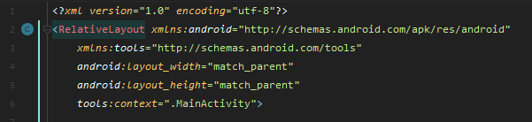
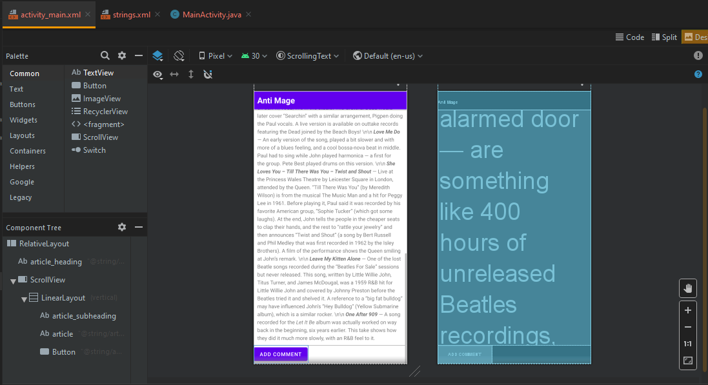

# Laporan Praktikum #5 - ScrollView

## Tujuan Pembelajaran

Setelah menempuh materi percobaan ini, mahasiswa mampu mengenal:
1. Cara menggunakan kode XML untuk menambahkan beberapa element TextView.
2. Cara menggunakan kode XML untuk menentukan tampilan yang bergeser (ScrollView). 
3. Cara menampilkan teks dengan format tag HTML.
4. Bagaimana mengatur style TextView pada background dan teks.
5. Bagaimana cara memasukkan tautan web ke dalam teks.

## Praktikum

### Task Guide

1. Pertama, buatlah project baru dan pilih no activity

   <br>

2. Atur konfigurasi project seperti dibawah

   <br>

2. Ganti ViewGroup menjadi RelativeLayout seperti dibawah ini
   
   <br>

3. Tambahkan TextView baru ***Heading*** diatas TextView Hello World ! dengan konfigurasi seperti dibawah

   <br>

4. Tambahkan lagi TextView baru ***Sub Heading*** diatas TextView Hello World ! dengan konfigurasi seperti di modul
5. Ubah isi TextView ***Hello World!*** seperti pada modul
6. Buka ```string.xml``` dan tambahkan string baru untuk mengisi artikel yang ada pada text view seperti dibawah ini

   <br>

7. Tambahkan ```android:autoLink="web"``` dalam article_text sehingga link yang ada pada artikel dapat dieksekusi
8. Tambahkan ***ScrollView*** dan masukan article_text kedalam scroll view tadi
9. Tambahkan ```LinearLayout``` kedalam scroll view dan masukan ```article_subheading``` dan ```article_text``` kedalam linear layout tersebut agar saat text dislide kebawah, sub heading juga ikut tergeser

### Hasil

1. Jika sudah menjalankan semua guide build aplikasi(emulator/install via usb) dan hasilnya seperti dibawah

   <br>
   <br>

### Coding Challenge
1. Tambahkan button add comment dibawah artikel
   <br>

### HomeWork
1. Ganti subheading berada di samping kiri artikel

   <br>
   <br>
   <br>
   <br>

### Pertanyaan
1. Berapa banyak view yang dapat digunakan didalam ScrollView?

   Jawab: hanya satu, dapat lebih jika dimasukan kedalam linearlayout. karena ScrollView hanya dapat memiliki 1 buah child

   <br>

2. Atribut XML manakah yand dipakai di ```LinearLayout``` untuk menampilkan view side by side?

   Jawab: ```android:orientation="horizontal"```

3. Atribut XML manakah yand dipakai untuk mendefinisikan width di ```LinearLayout``` di dalam scroll view?

   Jawab: ```android:layout_width="match_parent"```

## Pernyataan Diri

Saya menyatakan isi tugas, kode program, dan laporan praktikum ini dibuat oleh saya sendiri. Saya tidak melakukan plagiasi, kecurangan, menyalin/menggandakan milik orang lain.

Jika saya melakukan plagiasi, kecurangan, atau melanggar hak kekayaan intelektual, saya siap untuk mendapat sanksi atau hukuman sesuai peraturan perundang-undangan yang berlaku.

Ttd,

***(Pandu Dwi Laksono)***