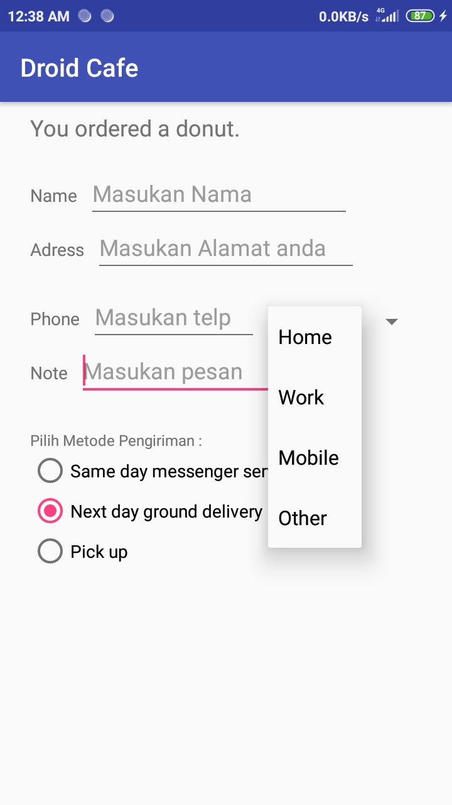

# Laporan Praktikum #6 - Input Control

## Tujuan Pembelajaran

Setelah menempuh materi percobaan ini, mahasiswa mampu mengenal:
1. Bagaimana cara mengganti input untuk mengaktifkan enable suggestions, auto-capitalization, dan password obfuscation.
2. Bagaimana cara mengganti layout keyboard yang umum dan spesifik
3. Bagaimana cara menambah radio button untuk user memilih item dari beberapa pilihan item
4. Bagaimana cara menambah spinner untuk memunculkan menu dropdown dan memilih salah satu pilihan yang ada

## Praktikum

### Task Guide
1. Input text biasa dimana dapat dimasukan text dan terdapat button centang dipojokan jika selesai mengisi text

     

2. Menambahkan multiple line edit text dimana dapat digunakan untuk mengisi text yang panjang seperti alamat

     

3. Menambahkan edit text dengan inputtype phone sehingga sewaktu mengisi layout keyboard yang muncul berupa angka

     

4. Mengkombinasikan 2 buah input type berupa multiline dan textCapSetences agar dapat menginput beberapa baris kata dan setiap awal kalimat diawali huruf kapital

    

5. Menambahkan radio button untuk memilih metode pengiriman

    

6. Menambahkan spinner untuk drop down menu guna tipe nomor telepoh yang diinputkan

    

## Pernyataan Diri

Saya menyatakan isi tugas, kode program, dan laporan praktikum ini dibuat oleh saya sendiri. Saya tidak melakukan plagiasi, kecurangan, menyalin/menggandakan milik orang lain.

Jika saya melakukan plagiasi, kecurangan, atau melanggar hak kekayaan intelektual, saya siap untuk mendapat sanksi atau hukuman sesuai peraturan perundang-undangan yang berlaku.

Ttd,

***(Pandu Dwi Laksono)***