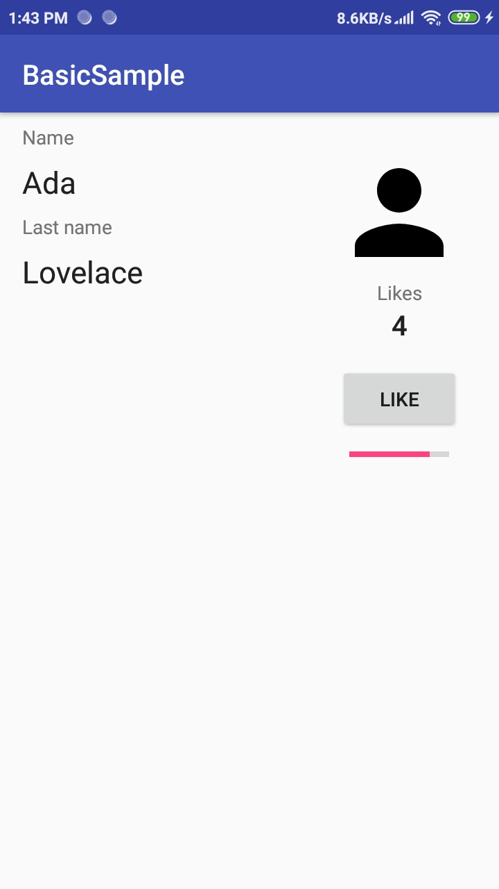

# Laporan Praktikum #7 - Data Binding

## Tujuan Pembelajaran
Setelah mempelajari materi ini, Anda diharapkan mampu:
1. melakukan konfigurasi data binding pada project Android;
2. menerapkan data binding pada project Android.

## Praktikum

### Task Guide
1. Tampilan awal sebelum digunakan data binding

     
     

2. Tampilan setelah digunakan data binding, terlihat sama, tetapi komponen telah diganti dengan sumber data yang telah dideklarasikan

     
     
     
     

## Kesimpulan

Mengetahui penggunaan data binding

## Pernyataan Diri

Saya menyatakan isi tugas, kode program, dan laporan praktikum ini dibuat oleh saya sendiri. Saya tidak melakukan plagiasi, kecurangan, menyalin/menggandakan milik orang lain.

Jika saya melakukan plagiasi, kecurangan, atau melanggar hak kekayaan intelektual, saya siap untuk mendapat sanksi atau hukuman sesuai peraturan perundang-undangan yang berlaku.

Ttd,

***(Pandu Dwi Laksono)***