# Laporan Praktikum #8 - Multi Activities

## Tujuan Pembelajaran
Setelah mempelajari materi ini, Anda diharapkan mampu:
1. melakukan perpindahan activity dalam aplikasi android.
2. menerapkan beberapa activity pada project Android.

## Praktikum
1. Hasil test file guide 1

    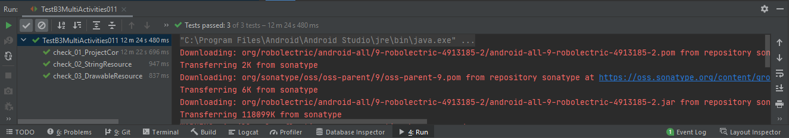 

2. Hasil test file guide 2

    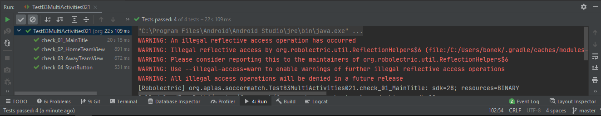 

3. Hasil test file guide 3

    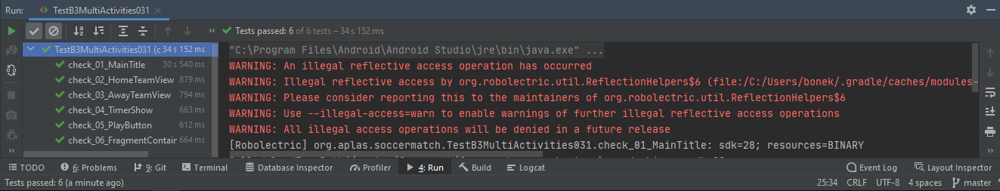 

4. Hasil test file guide 4

    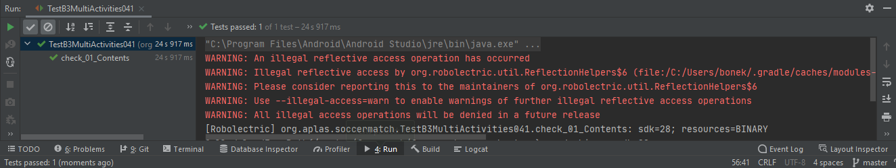 

5. Hasil test file guide 5

    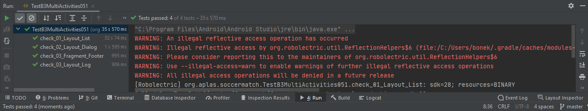 

6. Hasil test file guide 6

    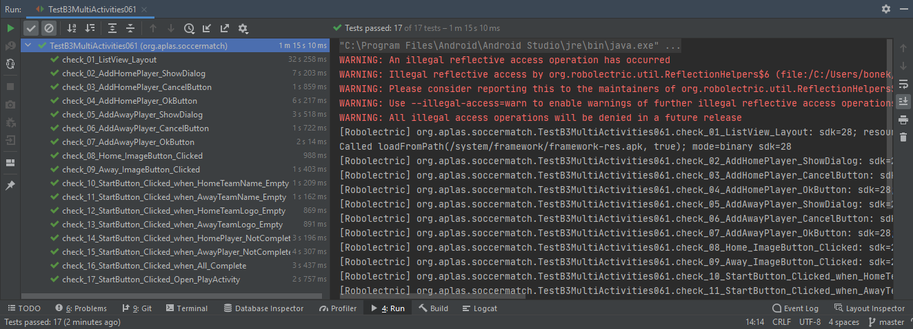 

7. Hasil test file guide 7

    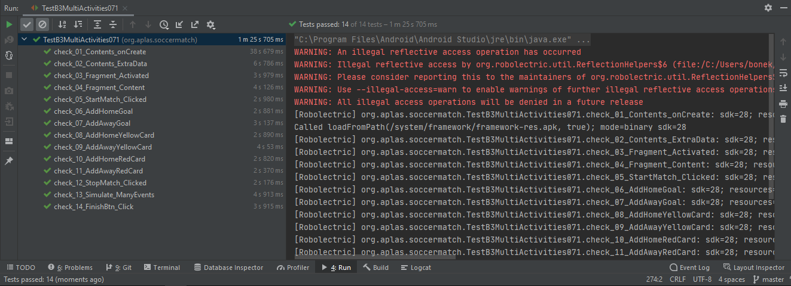 

8. Hasil test file guide 8

    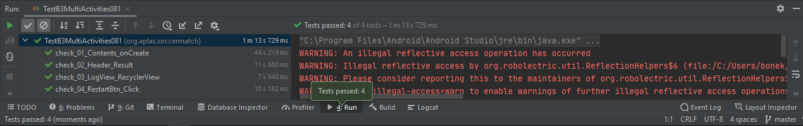 

## Hasil
1. Halaman awal aplikasi. Memasukan nama tim, logo, dan anggota tim

    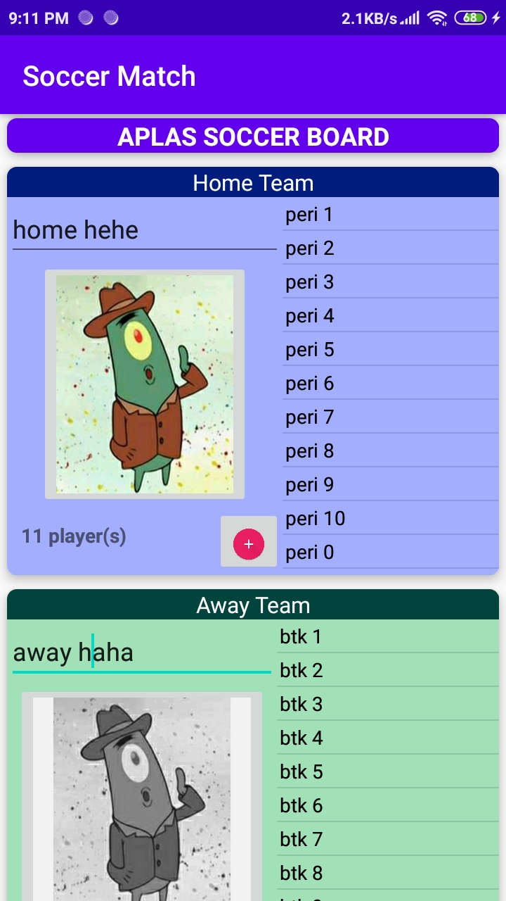 
    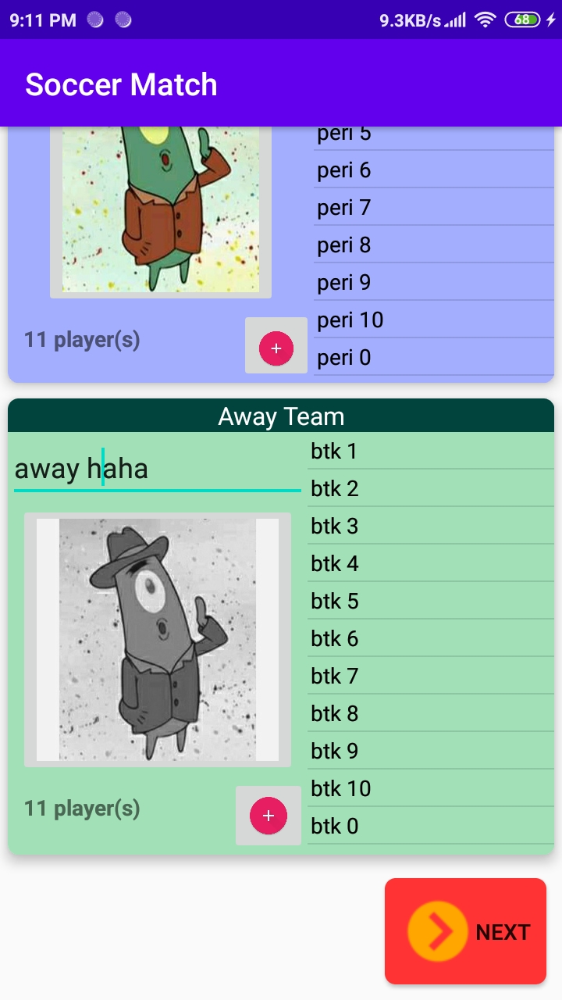 

2. Menambahkan gol untuk tim home

    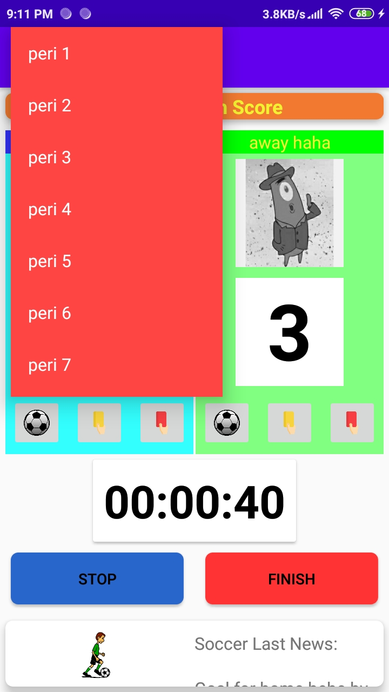 

3. Menambahkan kartu kuning untuk tim home

    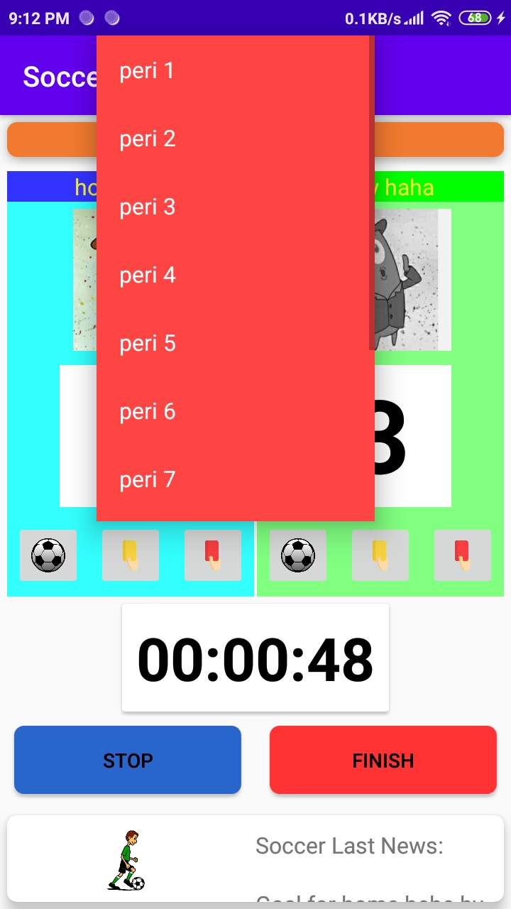 

4. Menambahkan kartu merah untuk tim home

    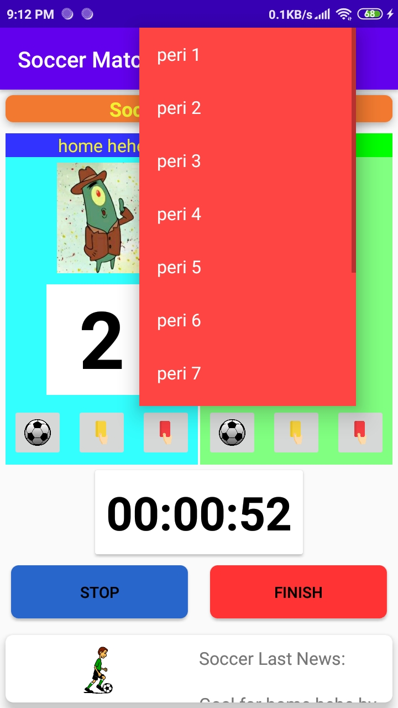 

5. Menambahkan gol untuk tim away

    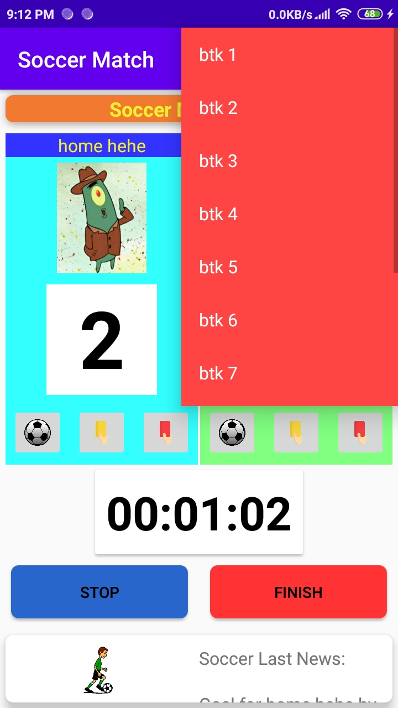 

6. Menambahkan kartu kuning untuk tim away

     

7. Menambahkan kartu merah untuk tim away

    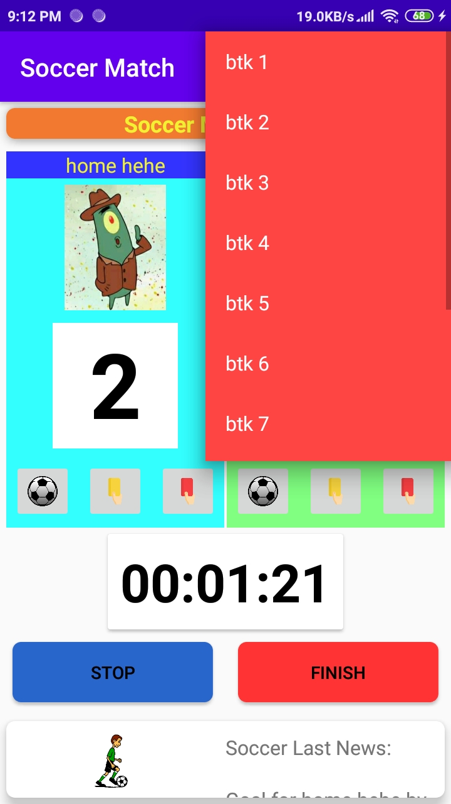 

8. Hasil jika gol berhasil ditambahkan

    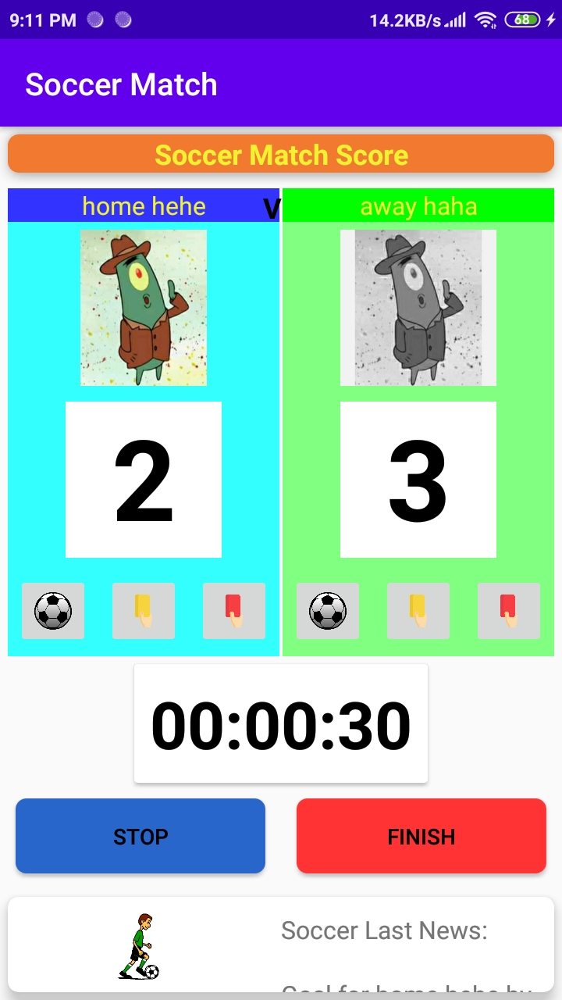 

9. Hasil akhir jika match diakhiri

    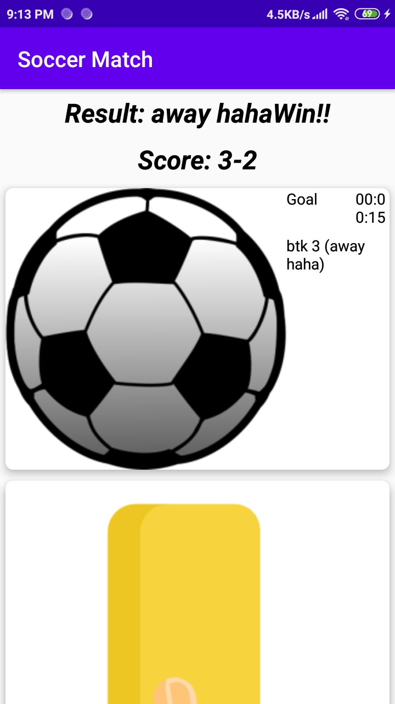 

## Kesimpulan

Mengetahui penggunaan beberapa activity dalam suatu project

## Pernyataan Diri

Saya menyatakan isi tugas, kode program, dan laporan praktikum ini dibuat oleh saya sendiri. Saya tidak melakukan plagiasi, kecurangan, menyalin/menggandakan milik orang lain.

Jika saya melakukan plagiasi, kecurangan, atau melanggar hak kekayaan intelektual, saya siap untuk mendapat sanksi atau hukuman sesuai peraturan perundang-undangan yang berlaku.

Ttd,

***(Pandu Dwi Laksono)***