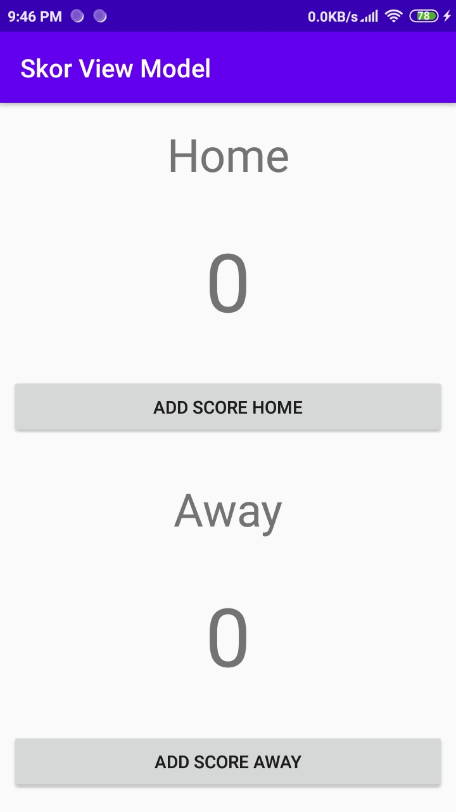
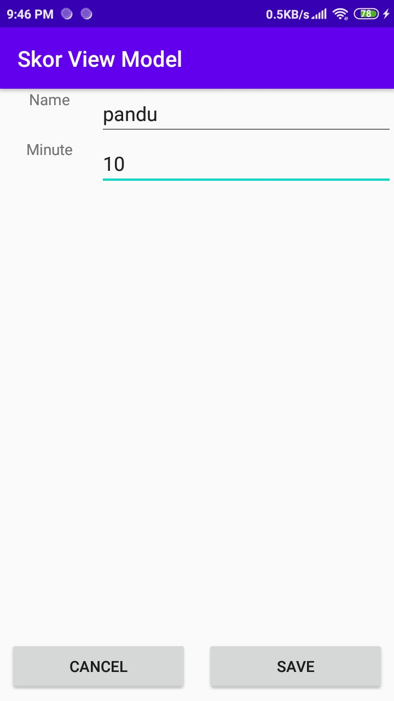
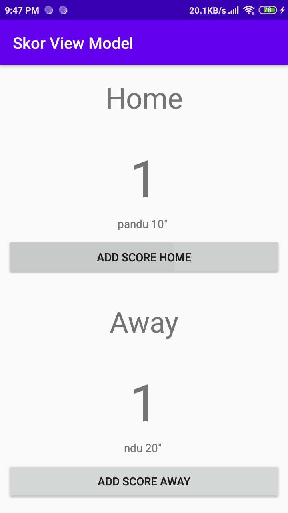

# Laporan Praktikum #9 - View Model

## Tujuan Pembelajaran
Setelah mempelajari materi ini, Anda diharapkan mampu:
1. mengenal tentang arsitektur MVVM;
2. menjelaskan lifecycle view model pada MVVM;
3. menerapkan view model pada android.

## Hasil
1. Halaman awal aplikasi. terdapat 2 buah tim, home dan away. Terdapat skor yang ditampilkan dan button add score jika terjadi gol

     

2. Tampilan add score jika terjadi gol. Terdapat input untuk memasukan nama pemain dan menit terjadinya gol

     

3. Tampilan ketika gol berhasil ditambahkan

     

   

## Kesimpulan

Mengetahui penggunaan view model dan penerapan dalam project android

## Pernyataan Diri

Saya menyatakan isi tugas, kode program, dan laporan praktikum ini dibuat oleh saya sendiri. Saya tidak melakukan plagiasi, kecurangan, menyalin/menggandakan milik orang lain.

Jika saya melakukan plagiasi, kecurangan, atau melanggar hak kekayaan intelektual, saya siap untuk mendapat sanksi atau hukuman sesuai peraturan perundang-undangan yang berlaku.

Ttd,

***(Pandu Dwi Laksono)***