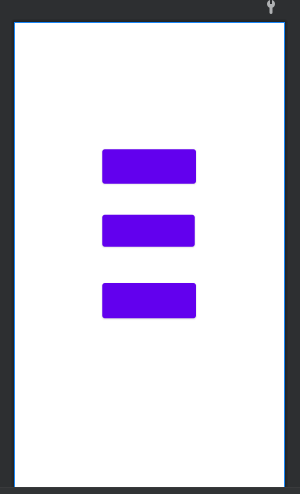
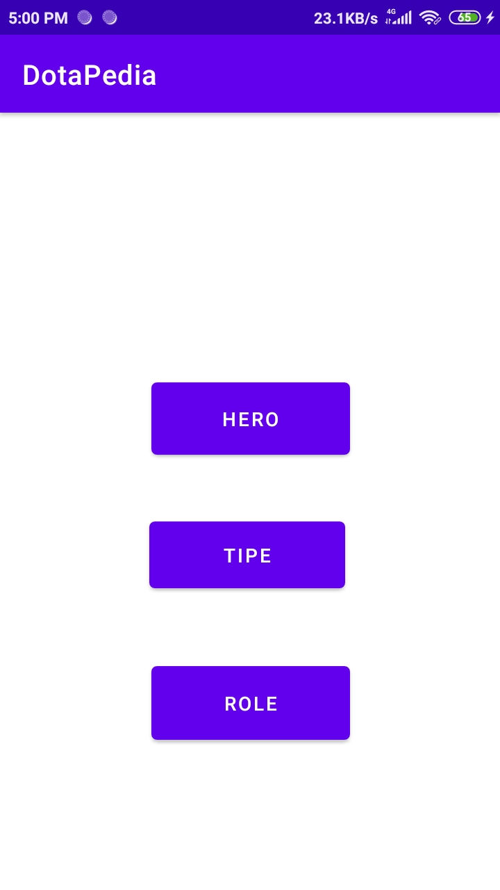

# Laporan Kuis 2

## Data Binding

### Source

1. MainActivity.java
```java 
package org.dotapedia;

public class MainActivity extends AppCompatActivity {

    private ActivityMainBinding activityMainBinding;

    @Override
    protected void onCreate(Bundle savedInstanceState) {
        super.onCreate(savedInstanceState);
        setContentView(R.layout.activity_main);


        activityMainBinding = DataBindingUtil.setContentView(this, R.layout.activity_main);
        activityMainBinding.setHero(getCurrentTitle());
        activityMainBinding.setTipe(getCurrentTitle());
        activityMainBinding.setRole(getCurrentTitle());
    }


    private Title getCurrentTitle(){
        Title title = new Title();
        title.setBtnHeroName("Hero");
        title.setBtnTipeName("Tipe");
        title.setBtnRoleName("Role");
        return title;
    }
}
```

2. Title.java
```java
package org.dotapedia;

public class Title {
    private String btnHeroName;
    private String btnTipeName;
    private String btnRoleName;

    public Title() {
        this.btnHeroName = btnHeroName;
        this.btnTipeName = btnTipeName;
        this.btnRoleName = btnRoleName;

    }

    public String getBtnRoleName() {
        return btnRoleName;
    }

    public void setBtnRoleName(String btnRoleName) {
        this.btnRoleName = btnRoleName;
    }

    public String getBtnTipeName() {
        return btnTipeName;
    }

    public void setBtnTipeName(String btnTipeName) {
        this.btnTipeName = btnTipeName;
    }

    public String getBtnHeroName() {
        return btnHeroName;
    }

    public void setBtnHeroName(String btnHeroName) {
        this.btnHeroName = btnHeroName;
    }
}

```

3. activity_main.xml
```java
<?xml version="1.0" encoding="utf-8"?>
<layout xmlns:android="http://schemas.android.com/apk/res/android"
    xmlns:app="http://schemas.android.com/apk/res-auto"
    xmlns:tools="http://schemas.android.com/tools">

    <data>
        <variable
            name="Hero"
            type="org.dotapedia.Title" />
        <variable
            name="Tipe"
            type="org.dotapedia.Title" />
        <variable
            name="Role"
            type="org.dotapedia.Title" />
    </data>

    <androidx.constraintlayout.widget.ConstraintLayout
        android:layout_width="match_parent"
        android:layout_height="match_parent"
        tools:context=".MainActivity">
        <Button
            android:id="@+id/btn_hero"
            android:layout_width="143dp"
            android:layout_height="64dp"
            android:layout_marginStart="150dp"
            android:layout_marginTop="188dp"
            android:layout_marginEnd="150dp"
            android:text="@{Hero.btnHeroName}"
            app:layout_constraintEnd_toEndOf="parent"
            app:layout_constraintStart_toStartOf="parent"
            app:layout_constraintTop_toTopOf="parent" />

        <Button
            android:id="@+id/btn_tipe"
            android:layout_width="141dp"
            android:layout_height="60dp"
            android:layout_marginStart="150dp"
            android:layout_marginTop="288dp"
            android:layout_marginEnd="150dp"
            android:text="@{Tipe.btnTipeName}"
            app:layout_constraintEnd_toEndOf="parent"
            app:layout_constraintHorizontal_bias="0.533"
            app:layout_constraintStart_toStartOf="parent"
            app:layout_constraintTop_toTopOf="parent" />

        <Button
            android:id="@+id/btn_role"
            android:layout_width="143dp"
            android:layout_height="65dp"
            android:layout_marginStart="150dp"
            android:layout_marginTop="392dp"
            android:layout_marginEnd="150dp"
            android:text="@{Role.btnRoleName}"
            app:layout_constraintEnd_toEndOf="parent"
            app:layout_constraintStart_toStartOf="parent"
            app:layout_constraintTop_toTopOf="parent" />
    </androidx.constraintlayout.widget.ConstraintLayout>
</layout>

```

### Hasil
1. layout di android studio

    <br>

2. hasil di aplikasi

    <br>

## Kesimpulan

Mengetahui penggunaan data binding di aplikasi dalam pengerjaan kuis

## Pernyataan Diri

Saya menyatakan isi tugas, kode program, dan laporan praktikum ini dibuat oleh saya sendiri. Saya tidak melakukan plagiasi, kecurangan, menyalin/menggandakan milik orang lain.

Jika saya melakukan plagiasi, kecurangan, atau melanggar hak kekayaan intelektual, saya siap untuk mendapat sanksi atau hukuman sesuai peraturan perundang-undangan yang berlaku.

Ttd,

***(Pandu Dwi Laksono)***