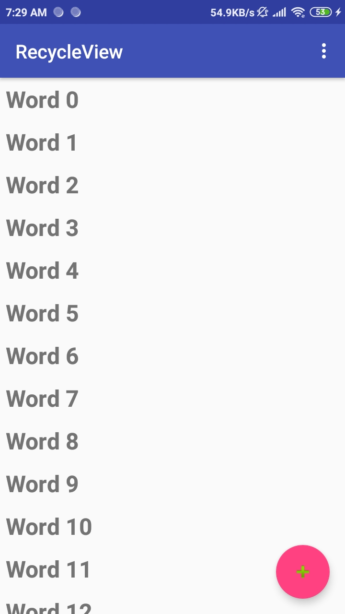
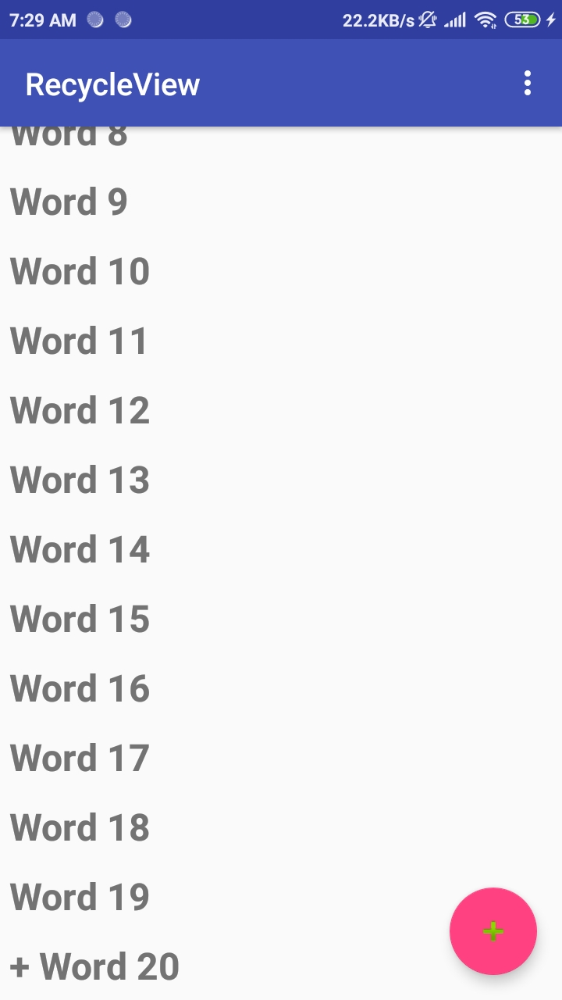
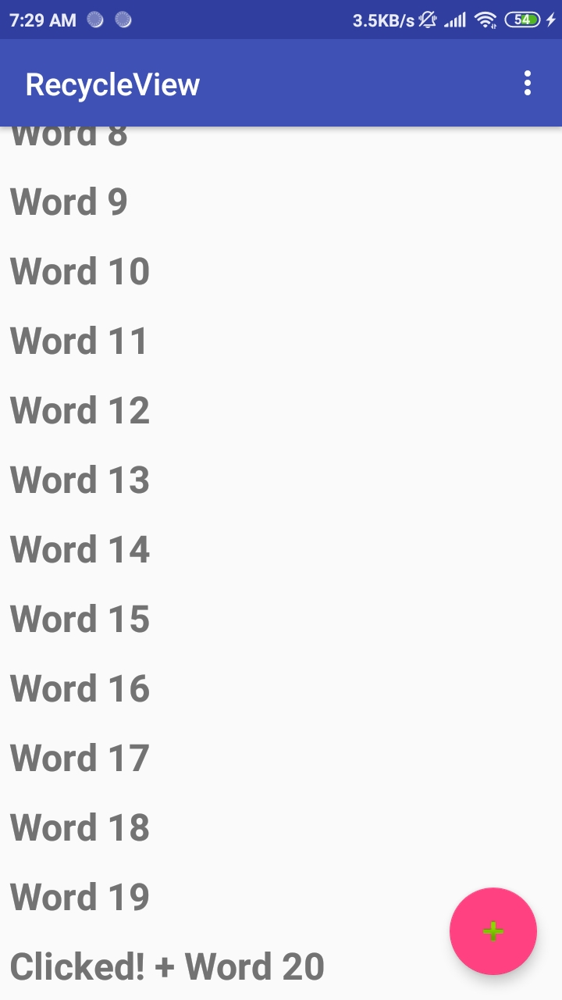

# Laporan Praktikum #11 - Recycle View

## Tujuan Pembelajaran
Setelah mempelajari materi ini, Anda diharapkan mampu:
1. menambahkan Recycler View pada aplikasi Android;
2. menampilkan Data sederhana dengan RecyclerView;
3. menerapkan Recycling ViewHolders;
4. menambahkan DataBinding ke Adapter.

## Hasil
1. Tampilan awal recycle view. Digunakan looping word 20 klai sehingga dapat s

     

2. Tampilan saat word ditambahkan menggunakan FAB

     

3. Tampilan saat word diklick. Akan muncul tulisan clicked disamping text word tersebut
    
     
    
## Kesimpulan

Mengetahui penggunaan recycle view dalam project dalam list data

## Pernyataan Diri

Saya menyatakan isi tugas, kode program, dan laporan praktikum ini dibuat oleh saya sendiri. Saya tidak melakukan plagiasi, kecurangan, menyalin/menggandakan milik orang lain.

Jika saya melakukan plagiasi, kecurangan, atau melanggar hak kekayaan intelektual, saya siap untuk mendapat sanksi atau hukuman sesuai peraturan perundang-undangan yang berlaku.

Ttd,

***(Pandu Dwi Laksono)***