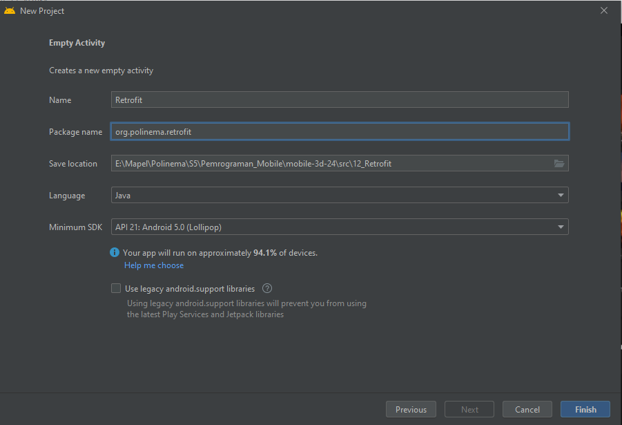
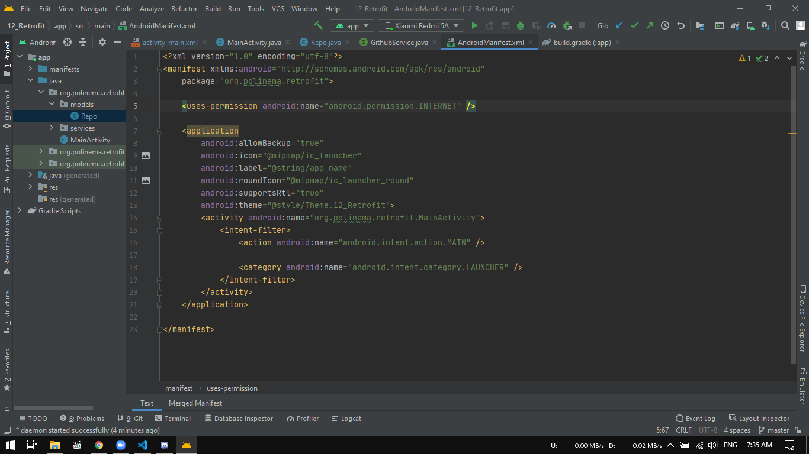
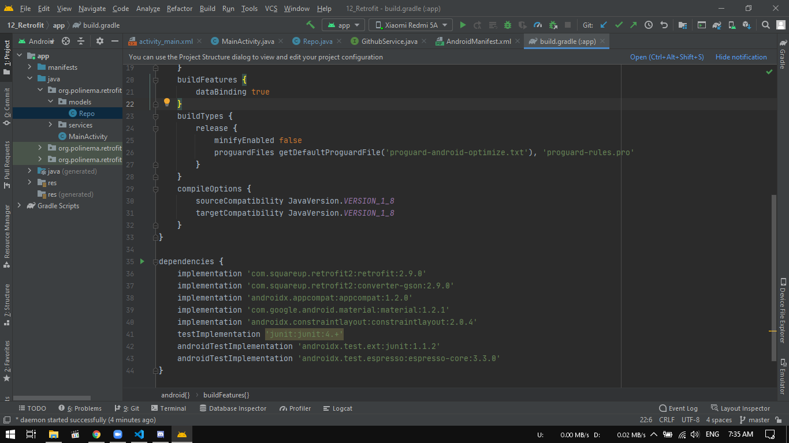
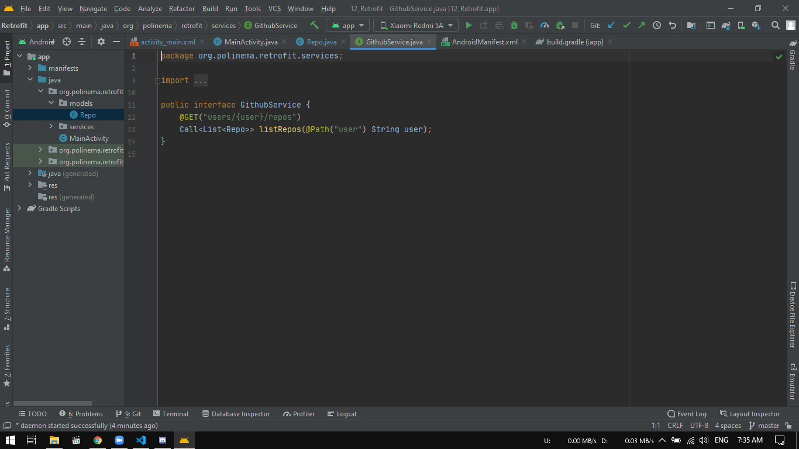
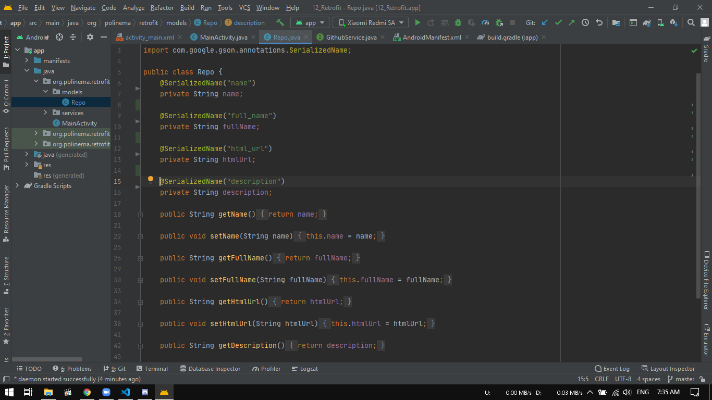
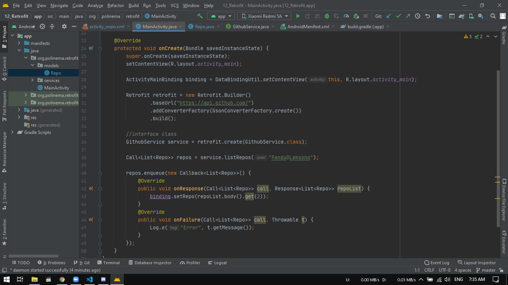
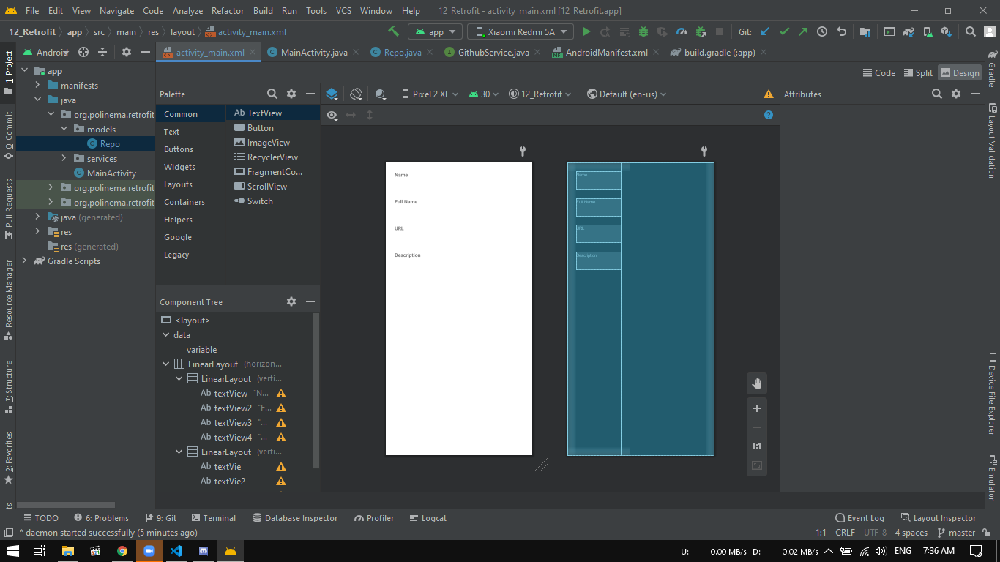
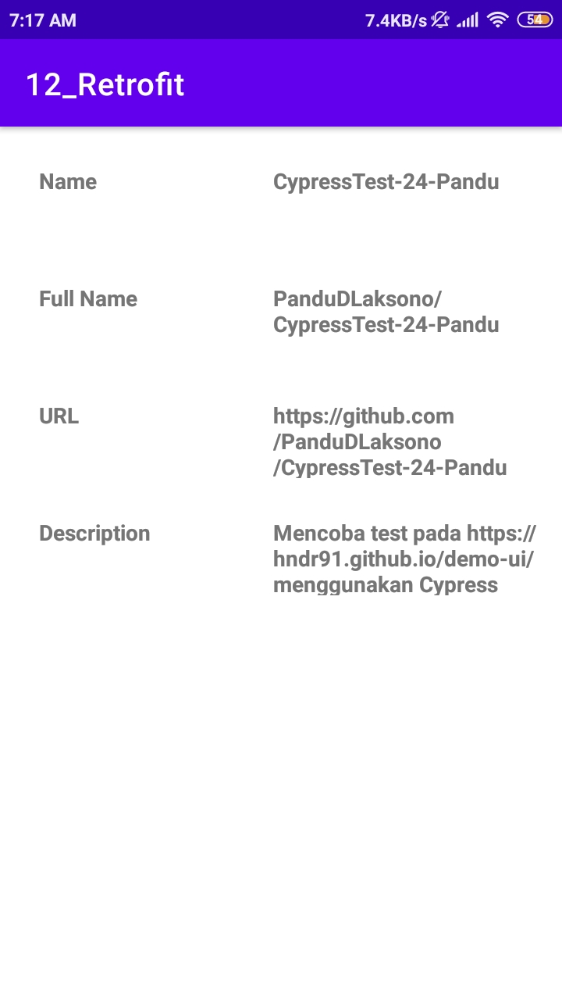

# Laporan Praktikum #12 - Retrofit

## Tujuan Pembelajaran
Setelah mempelajari materi ini, Anda diharapkan mampu:
1. mengonfigurasi Retrofit pada Android,
2. melakukan request ke RESTful API menggunakan Retrofit.

## Praktikum
1. Silakan buat New Project di Android Studio.

    <br>

2. Tambahkan izin koneksi internet di AndroidManifest.xml

    <br>

3. Tambahkan dependencies library Retrofit, converter-gson, dan compileOptions.

    <br>

4. Buatlah package bernama services lalu buat class interface didalamnya.

    <br>

5. Buatlah package bernama models lalu buat class POJO didalamnya.

    <br>

6. Pada class MainActivity, buat request ke REST API

    <br>

7. Pada activity_main.xml, dibuat layout seperti berikut

    <br>

## Hasil
1. Tampilan aplikasi setelah dijalankan. Akan diminta request API github bersadarkan class POJO dan diambil data repository berdasarkan arraylist di method ``` public void onResponse ```

    <br>

    
## Kesimpulan

Mengetahui penggunaan retrofit untuk pemanggilan REST API dan mengaplikasikan kedalam project

## Pernyataan Diri

Saya menyatakan isi tugas, kode program, dan laporan praktikum ini dibuat oleh saya sendiri. Saya tidak melakukan plagiasi, kecurangan, menyalin/menggandakan milik orang lain.

Jika saya melakukan plagiasi, kecurangan, atau melanggar hak kekayaan intelektual, saya siap untuk mendapat sanksi atau hukuman sesuai peraturan perundang-undangan yang berlaku.

Ttd,

***(Pandu Dwi Laksono)***