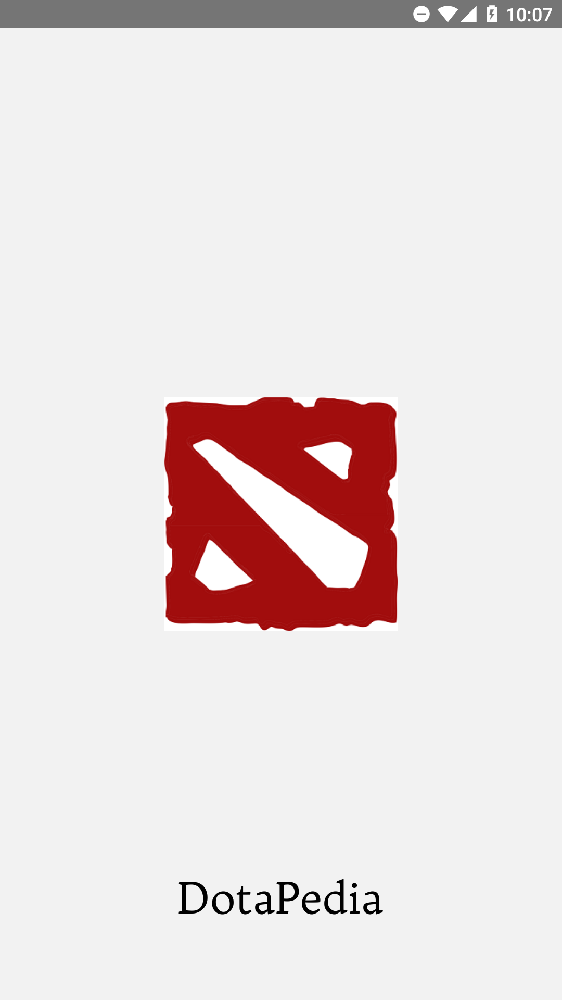
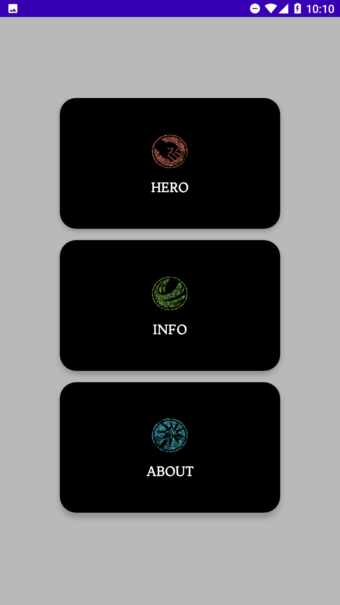
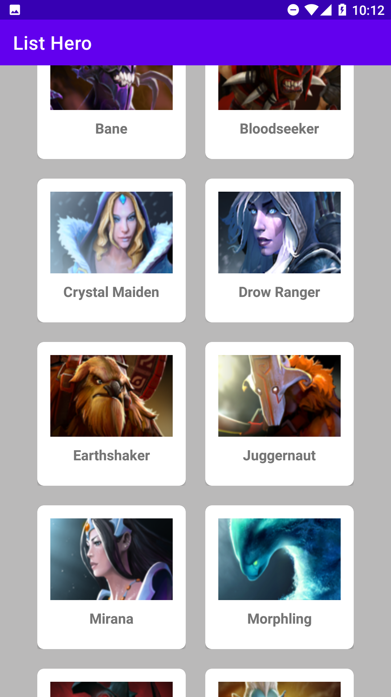
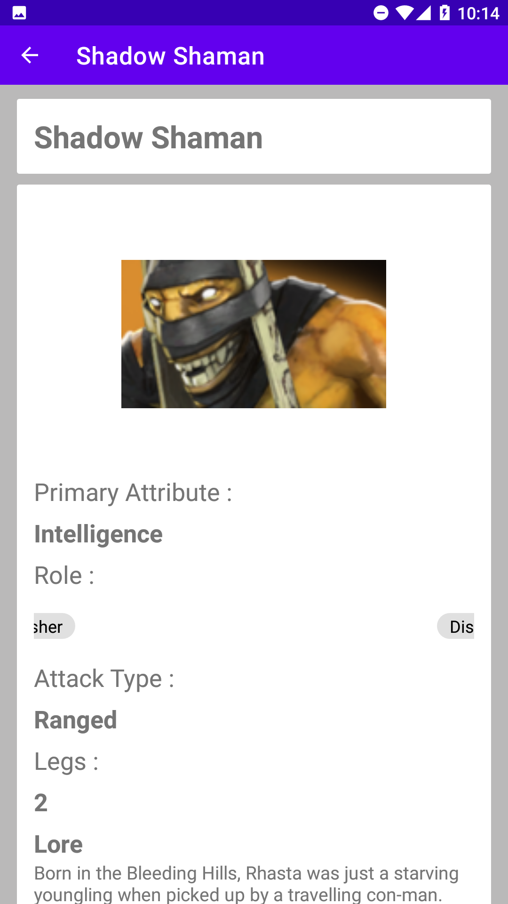
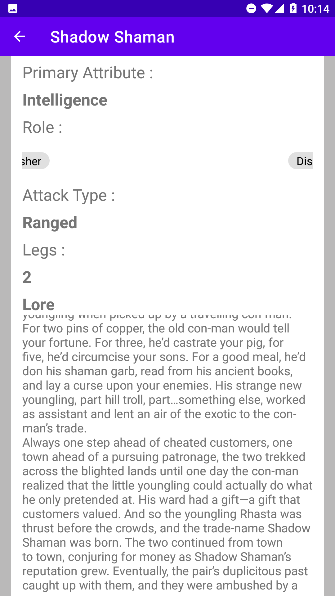
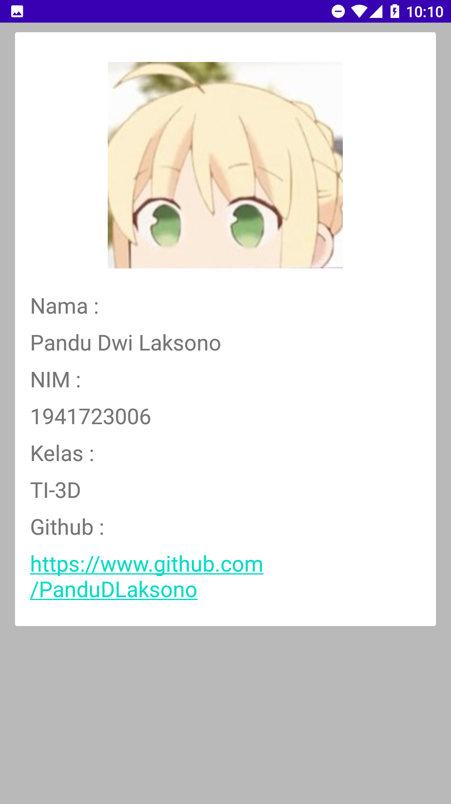
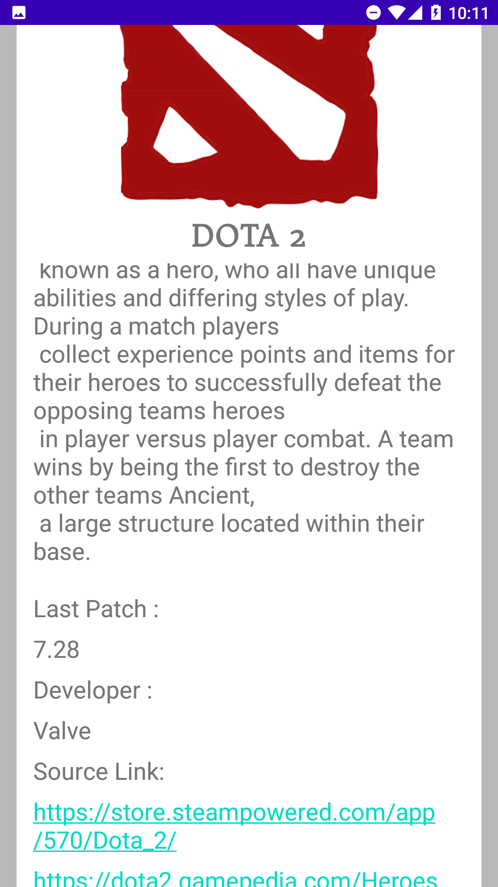

# Laporan Project UAS - DotaPedia

## Deskripsi Aplikasi

DotaPedia adalah sebuah aplikasi android berbasis java yang diperuntukan kepada pemain game Dota 2 pada kususnya. Pada aplikasi ini terdapat info tentang hero - hero yang terdapat pada Dota 2. Aplikasi ini mengambil data Hero menggunakan REST API

## Identitas Pengembang
Aplikasi ini dikembangkan pada Desember 2020 oleh :  
Nama : Pandu Dwi Laksono  
NIM  : 1941723006  
Kelas : TI-3D

## Fitur - fitur Aplikasi

1. SplashScreen

     

2. Menu Utama. Terdapat 3 buah button: hero, info, about, yang mengarahkan ke menu - menu berikutnya

     

3. Menu Hero. Pada menu ini akan menampilkan list hero menggunakan recycle view

     

4. Menu Detail Hero. Pada menu ini ditampilkan informasi detail hero 

     
     

5. Menu Info. Berisi info tentang pengembang aplikasi 

     

6. Menu About. Berisi informasi tentang apa itu Dota 2

     

## Saran 

Untung pengembangan selanjutnya. maka dapat ditambahkan :
1. Informasi hero lebih banyak baik tentang daya serang (attack) dan daya bertahan(defense)
2. Skill/kemampuan yang dimiliki hero - hero tersebut

## Kesimpulan

Kesimpulan yang saya dapatkan dari pembuatan aplikasi DotaPedia ialah :
1. Dapat membuat aplikasi android sendiri
2. Dapat menyalurkan hobi dalam bermain ke dalam kegiatan perkuliahan
3. Mendapatkan wawasan baru dalam pengembangan aplikasi android baik dari kampus maupun dari pihak luar
4. Terdapat beberapa masalah dalam pembuatan project karena masih awam dalam pemrograman android

## Sumber Data

1. Data Hero : https://www.dota2.gamepedia.com/Heroes
2. API : https://pandudlaksono.github.io/API/db.json
3. Tutorial : https://www.youtube.com/c/eddydn71/
4. Tutorial : https://www.youtube.com/channel/UC_Fh8kvtkVPkeihBs42jGcA

